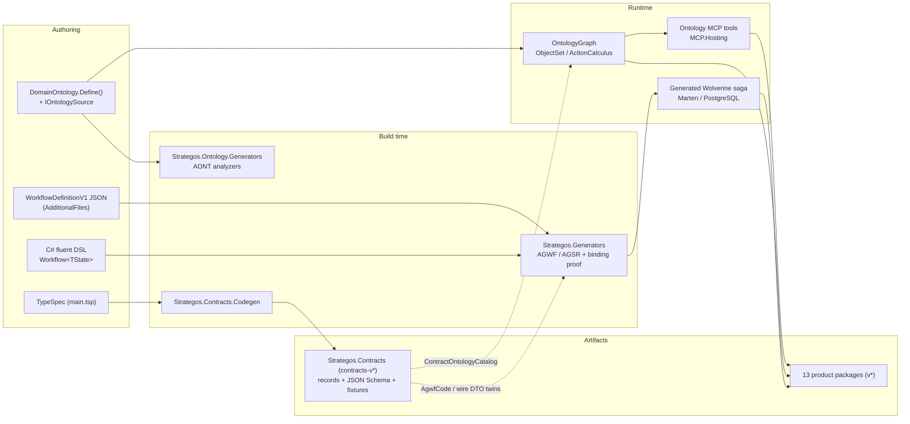

# Strategos System Index

Entry-point reference mapping every named component and concept in `lvlup-sw/strategos` to its authoritative location. Current release: **3.0.0-rc.1** (thirteen product packages) and **Contracts 0.12.0**, both tagged on `f7a7264` (2026-09-09); see [CHANGELOG](../../CHANGELOG.md#300-rc1---2026-09-09) and the [consumer-upgrade handoff](../handoffs/2026-09-09-3.0.0-rc.1-consumer-upgrade.md).

---

## Named Components

### Packages — workflow line (MinVer-versioned, `v*` train)

| Name | Role | Document Reference |
|------|------|--------------------|
| **`LevelUp.Strategos`** | Fluent workflow DSL and core abstractions: `Workflow<TState>`, `IWorkflowStep<TState>`, `StepResult<TState>`, `StepContext`; fork/join, branch, loop, approval, compensation, confidence routing; export-only wire projection `WorkflowDefinitionProjection.ToContract()`. | [Packages § Strategos](./packages.md#strategos), [Workflow API](../src/content/docs/reference/api/workflow.md); code `src/Strategos/` |
| **`LevelUp.Strategos.Generators`** | Roslyn incremental generators (`WorkflowIncrementalGenerator`, `StateReducerIncrementalGenerator`) that lower a definition to the saga, phase enum, commands, events, reducers, DI extensions and Mermaid; the JSON import front-end; the AGWF/AGSR diagnostics; the workflow-binding proof. netstandard2.0 analyzer package; carries the identity abstractions inside its analyzer folder. | [Packages § Strategos.Generators](./packages.md#strategosgenerators), [Generators API](../src/content/docs/reference/api/generators.md), [Design § Source-Generated Artifacts](./design.md#source-generated-artifacts); code `src/Strategos.Generators/` |
| **`LevelUp.Strategos.Infrastructure`** | Runtime implementations: Thompson Sampling (`ContextualAgentSelector`), the four loop detectors, `BudgetGuard` / `ScarcityLevel`. | [Packages § Strategos.Infrastructure](./packages.md#strategosinfrastructure), [Infrastructure API](../src/content/docs/reference/api/infrastructure.md) |
| **`LevelUp.Strategos.Agents`** | Microsoft.Extensions.AI integration: `IAgentStep<TState, TResult>`, `AgentStepBuilder<TState, TResult>`, `IToolSource`, streaming handlers, conversation threads. | [Packages § Strategos.Agents](./packages.md#strategosagents), [Agents API](../src/content/docs/reference/api/agents.md), [MEAI 10.5 design](../designs/2026-05-17-strategos-agents-meai-10-5.md), [streaming + tool source design](../designs/2026-05-23-strategos-agents-streaming-toolsource.md) |
| **`LevelUp.Strategos.Agents.Mcp`** | `McpToolSource`, an `IToolSource` over the ModelContextProtocol C# SDK; kept apart so the core agents package carries no MCP dependency. | [Packages § Strategos.Agents.Mcp](./packages.md#strategosagentsmcp) |
| **`LevelUp.Strategos.Rag`** | **Deprecated.** Vector-store adapters (`IVectorSearchAdapter`, `InMemoryVectorSearchAdapter`); superseded by ontology object sets. Still published. | [Packages § Strategos.Rag](./packages.md#strategosrag), [RAG API](../src/content/docs/reference/api/rag.md) |
| **`LevelUp.Strategos.Identity.Abstractions`** | The identity seam: `WorkflowIdentity`, `AgentIdentity`, `IAgentIdentityProvider`, `IAgentIdentityAccessor`, `IPhaseAwareSaga`. No dependencies; arrives transitively with the core package. | [Packages § Strategos.Identity.Abstractions](./packages.md#strategosidentityabstractions), [G1 identity-seam design](../designs/2026-05-16-g1-agent-identity-seam.md) |

### Packages — ontology line (MinVer-versioned, `v*` train)

| Name | Role | Document Reference |
|------|------|--------------------|
| **`LevelUp.Strategos.Ontology`** | Descriptor model, fluent `DomainOntology.Define()` builder, `OntologyGraph` / `OntologyGraphBuilder`, object sets, the action calculus, principals and authority, `IOntologySource`, chunking, `IEmbeddingProvider`, `IngestionPipeline<T>`. Takes no Wolverine or Marten dependency (U-2). | [Packages § Strategos.Ontology](./packages.md#strategosontology), [Ontology reference](../src/content/docs/reference/ontology/index.md), [Platform Architecture § 4.14](../src/content/docs/reference/platform-architecture.md#414-ontology-layer-strategosontology), [Ontology layer design](../designs/2026-02-24-ontology-layer.md) |
| **`LevelUp.Strategos.Ontology.Generators`** | Roslyn **analyzers** only — `OntologyDefinitionAnalyzer` reporting the `AONT` series. Emits no code despite the package name. | [Packages § Strategos.Ontology.Generators](./packages.md#strategosontologygenerators), [AONT diagnostics](../src/content/docs/reference/diagnostics/index.md), [Platform Architecture § 4.14.12](../src/content/docs/reference/platform-architecture.md#41412-analyzer-pipeline) |
| **`LevelUp.Strategos.Ontology.Npgsql`** | `PgVectorObjectSetProvider` (`IObjectSetProvider` + `IObjectSetWriter`) over PostgreSQL pgvector; `PgVectorOptions`, `IterativeScanOptions`. | [Npgsql reference](../src/content/docs/reference/ontology/npgsql.md), [Packages § Strategos.Ontology.Npgsql](./packages.md#strategosontologynpgsql) |
| **`LevelUp.Strategos.Ontology.Embeddings`** | `OpenAiCompatibleEmbeddingProvider`, an `IEmbeddingProvider` over any OpenAI-shaped embeddings endpoint. | [Packages § Strategos.Ontology.Embeddings](./packages.md#strategosontologyembeddings), [Embedding provider API](../src/content/docs/reference/ontology/api/embedding-provider.md) |
| **`LevelUp.Strategos.Ontology.MCP`** | SDK-free tool definitions: `OntologyToolDiscovery`, `OntologyExploreTool`, `OntologyQueryTool`, `OntologyActionTool`, `OntologyToolDescriptor`, the abstention union, `OntologyStubGenerator` (Python `.pyi` stubs). | [Packages § Strategos.Ontology.MCP](./packages.md#strategosontologymcp), [MCP integration guide](../src/content/docs/guide/ontology/mcp-integration.md), [MCP surface conformance design](../designs/2026-04-19-mcp-surface-conformance.md) |
| **`LevelUp.Strategos.Ontology.MCP.Hosting`** | The ModelContextProtocol-bound bridge: `OntologyMcpServerBuilderExtensions`, `OntologyServerToolFactory`, `IActionPrincipalResolver` / `ClaimsActionPrincipalResolver`, `LoggingOntologyAuditSink`. | [Packages § Strategos.Ontology.MCP.Hosting](./packages.md#strategosontologymcphosting) |

### Packages — contracts (pinned version, `contracts-v*` train)

| Name | Role | Document Reference |
|------|------|--------------------|
| **`LevelUp.Strategos.Contracts`** | The cross-product schema substrate. TypeSpec is canonical; the package ships C# records, JSON Schema and the builder-fixture corpus for SDLC events, the `WorkflowDefinitionV1` wire IR, gates, the fork/compensation edge, abstention, ontology action metadata and the AGWF catalog. Versioned independently (0.12.0). | [Contracts README](../../src/Strategos.Contracts/README.md), [Contracts CHANGELOG](../../src/Strategos.Contracts/CHANGELOG.md), [Packages § Strategos.Contracts](./packages.md#strategoscontracts), [schema-substrate design](../designs/2026-05-24-contracts-schema-substrate.md) |
| **`Strategos.Contracts.Codegen`** (repo tool, not published) | Emits the records from the JSON Schema: `RecordEmitter` (sealed / init-only / `IReadOnlyList<T>` shape), `AgwfCatalogEmitter` (`AgwfCode` enum, `agwf-catalog.json`, `docs/diagnostics/agwf.md`), `OntologyContractEmitter` behind the `ISchemaEmissionExtension` seam. Driven by `scripts/contracts-codegen.sh`. | [Contracts README § C# emitter decision](../../src/Strategos.Contracts/README.md#c-emitter-decision-t3--inv-6--inv-7-gate), [TypeSpec pipeline design](../designs/2026-04-18-typespec-contracts-pipeline.md); code `src/Strategos.Contracts.Codegen/` |

### Named machinery

| Name | Role | Document Reference |
|------|------|--------------------|
| **Workflow DSL** | `Workflow<TState>.Create(name)` yields an `IWorkflowBuilder<TState>`: `StartWith` / `Then` / `Branch` / `Fork` + `Join` / `RepeatUntil` / `AwaitApproval` / `OnFailure` / `Finally`; per-step `IStepConfiguration<TState>` (`WithRetry`, `WithTimeout`, `RequireConfidence` + `OnLowConfidence`, `Compensate`, `Performs`); `AllowDiagnosticFork`. Concrete domain nomenclature, never graph terms (U-4). | [Design § The Fluent DSL](./design.md#the-fluent-domain-specific-language), [Platform Architecture § 4.3–4.4](../src/content/docs/reference/platform-architecture.md#43-fluent-dsl-vocabulary); code `src/Strategos/Builders/` |
| **Saga lowering** | `SagaEmitter` (the Wolverine `Saga` implementing `IPhaseAwareSaga` and `JasperFx.IRevisioned`, dispatch claims, the rollback journal), `ExtensionsEmitter` (`Add{Pascal}Workflow()` DI registration), `StateReducerEmitter` (`[Append]` / `[Merge]` merge logic), plus `PhaseEnumEmitter`, `CommandsEmitter`, `EventsEmitter`, `TransitionsEmitter`, `WorkerHandlerEmitter`, `MermaidEmitter`. Sagas are emitted, never hand-written (U-1). | [Generators API](../src/content/docs/reference/api/generators.md), [Integrations § Wolverine](./integrations.md#wolverine); code `src/Strategos.Generators/Emitters/` |
| **JSON import front-end** | `WireToModelBridge` rehydrates `WorkflowDefinitionV1` documents supplied as `AdditionalFiles` into the same `WorkflowModel` the fluent parser produces; `WireMonikerResolver` binds simple-name step monikers to CLR types in the compilation (`AGWF025` / `AGWF026`). The importable subset is runtime-bindable-behavior-free; everything else is rejected with a per-carrier diagnostic (`AGWF027`–`AGWF034`). | [Strategy-compiler spec § Chosen Approach](../specs/2026-07-06-strategy-compiler-contracts.md#chosen-approach), [failure-mode map](../diagnostics/failure-modes.md); code `src/Strategos.Generators/Import/` |
| **Workflow-binding proof** | `WorkflowBindingProofAnalyzer` (generator side) over the shared `OntologyActionCatalog`; proves a `BoundToWorkflow` action against the closed workflow graph and reports `AGWF039`–`AGWF045`. Compilation-local. | [Action calculus § Behavioral refinement and workflow bindings](../src/content/docs/reference/action-calculus.md#behavioral-refinement-and-workflow-bindings); code `src/Strategos.Generators/Proof/`, `src/Shared/Analyzers/Proof/` |
| **`OntologyGraph` / `OntologyGraphBuilder`** | The frozen, hashed graph (`OntologyGraph.Version`, `TraverseLinks`) and the builder that merges domain ontologies, drains every `IOntologySource`, resolves cross-domain links and freezes — rejecting with `OntologyCompositionException` carrying runtime `AONT` diagnostics. | [Graph versioning](../src/content/docs/reference/ontology/graph-versioning.md), [Platform Architecture § 4.14.11](../src/content/docs/reference/platform-architecture.md#41411-domain-definition), [`IOntologyQuery` API](../src/content/docs/reference/ontology/api/ontology-query.md) |
| **`ObjectSet<T>` / `IObjectSetProvider`** | Composable query over a provider: `Where`, `TraverseLink`, `OfInterface`, `Include`, `SimilarTo`, `ExecuteAsync` / `StreamAsync`, `ApplyAsync(principal, …)`, `EventsAsync`. Providers: `InMemoryObjectSetProvider` (dev/test) and `PgVectorObjectSetProvider` (durable), both also `IObjectSetWriter`. | [Object set provider API](../src/content/docs/reference/ontology/api/object-set-provider.md), [edge foundation design](../designs/2026-06-03-ontology-edge-foundation.md), [edge-layer completion design](../designs/2026-06-04-v290-edge-layer-completion.md) |
| **`IOntologySource` / `OntologyDelta`** | Extension point for descriptors that are not hand-authored C#: a source streams `OntologyDelta` values that the builder folds into the same per-domain builders (`DescriptorSource.Ingested`). | [Ontology sources guide](../src/content/docs/guide/ontology/ontology-sources.md), [Source API](../src/content/docs/reference/ontology/api/source.md), [polyglot ingestion design](../designs/2026-05-10-ontology-2-5-0-polyglot-ingestion.md) |
| **MCP server surface** | `OntologyServerToolFactory.CreateServerTools(graph)` adapts the four tools `OntologyToolDiscovery` derives — `ontology_explore`, `ontology_query`, `ontology_action`, `ontology_validate` — into provider-bound `McpServerTool`s, preserving output schema, annotations and `_meta` (constraint summaries, action semantics, `ontologyVersion`). Tracks MCP revision 2026-07-28 (U-3). | [MCP integration guide](../src/content/docs/guide/ontology/mcp-integration.md), [DR-15 association traversal design](../designs/2026-06-16-dr15-mcp-association-traversal.md); code `src/Strategos.Ontology.MCP.Hosting/OntologyServerToolFactory.cs`, `src/Strategos.Ontology.MCP/OntologyToolDiscovery.cs` |
| **`ActionCalculus`** | The static proof kernel: `AnalyzeSequential` / `Sequential`, `Identity`, `AnalyzeRefinement`, `AnalyzeInverse`, `DeriveRollbackPlan`, `DeriveSequentialRollbackPlan`, `DeriveParallelRollbackPlan`, `DeriveScopedRollbackPlan`. Shared by the runtime and the netstandard analyzer. | [Typed action calculus](../src/content/docs/reference/action-calculus.md); code `src/Strategos.Ontology/Descriptors/ActionCalculus.cs` |
| **Ontology analyzers** | `OntologyDefinitionAnalyzer` is the single registered `DiagnosticAnalyzer`; it hosts the internal `ActionCompositionAnalyzer` (`AONT217`–`AONT221`, sequential-proof and coverage passes) and `OntologyInverseContractAnalyzer` (`AONT216`). | [AONT200-series](../src/content/docs/reference/diagnostics/aont-200-series.md), [Platform Architecture § 4.14.12](../src/content/docs/reference/platform-architecture.md#41412-analyzer-pipeline); code `src/Strategos.Ontology.Generators/Analyzers/` |
| **TypeSpec pipeline** | `main.tsp` → `tsp compile` (`@typespec/json-schema`) → `schemas/json-schema/*.json` → `Strategos.Contracts.Codegen` → `Generated/*.g.cs` + `docs/diagnostics/agwf.md`. Guarded by the codegen guard (regenerate-and-diff) and the breaking-change schema diff (`scripts/contracts-schema-diff.mjs` + `schemas/breaking-changes.allowlist.json`). | [Contracts README](../../src/Strategos.Contracts/README.md), [TypeSpec pipeline design](../designs/2026-04-18-typespec-contracts-pipeline.md); code `src/Strategos.Contracts/*.tsp`, `src/Strategos.Contracts/**/*.tsp` |
| **Fixture corpus** | `FixtureExportTests` export ≥ 100 `WorkflowDefinitionV1` fixtures to `artifacts/builder-fixtures/` (gitignored); the Contracts package embeds them under `contentFiles/any/any/fixtures/`. Every fixture lands in exactly one of importable-equivalent or specifically-rejected. | [publish-contracts.yml](../../.github/workflows/publish-contracts.yml), [failure-mode map](../diagnostics/failure-modes.md); code `tests/Strategos.Tests/FixtureExport/` |
| **Samples** | `samples/ContentPipeline` (approval gate + rollback), `samples/MultiModelRouter` (Thompson Sampling), `samples/AgenticCoder` (iteration loop with checkpoints), each with a test project. | [README § Try the Samples](../../README.md#try-the-samples), [Examples](../src/content/docs/examples/index.md) |
| **Basileus smoke** | `tests/basileus-smoke/` builds a consumer against the freshly packed feed as a release-readiness check (CI job "Basileus smoke"). | [ci.yml](../../.github/workflows/ci.yml); code `tests/basileus-smoke/` |

---

## Concept Glossary

| Term | Definition | Authoritative Section |
|------|------------|-----------------------|
| Durable workflow / saga lowering | A `[Workflow]` definition is lowered at build time into a Wolverine `Saga` persisted by Marten on PostgreSQL; steps become commands and events; the transactional outbox commits state and messages atomically. Since #206 the saga implements `JasperFx.IRevisioned` and retries `ConcurrencyException` three times, so concurrent deliveries cannot silently overwrite each other. | [Design § Runtime Architecture](./design.md#runtime-architecture), [Integrations](./integrations.md), [CHANGELOG § concurrency-guarded sagas](../../CHANGELOG.md#300-rc1---2026-09-09) |
| Persistence mode | `PersistenceMode.SagaDocument` (default): handlers reduce state onto the saga document. `PersistenceMode.EventSourced`: handlers append to the Marten stream and apply through `IEventSourcedState<TState>.ApplyEvent` (`AGWF015` / `AGWF016`). Typed derived compensation is saga-document-only in 3.0 (`AGWF045` on event-sourced). | `src/Strategos/Attributes/PersistenceMode.cs`, [Action calculus § Durable completed-prefix rollback](../src/content/docs/reference/action-calculus.md#durable-completed-prefix-rollback) |
| Phase enum persistence | The generated `Phase` enum persists by name under System.Text.Json and by ordinal under Newtonsoft. 3.0.0-rc.1 reorders members for fork and branch workflows, so a Newtonsoft store treats the upgrade as a data migration. | [Phase Enum Persistence](../src/content/docs/reference/phase-persistence.md) |
| Three validation tiers | Builder-runtime throws (`WorkflowBuilder`), Roslyn analyzer / generator diagnostics, and emitter-time guards. The earliest tier that can catch an error wins; diagnostic ids are public contract and are never reused or renumbered in a non-major release. | [U-5](../architecture/invariants/U-5-three-tiered-validation-stable-diagnostic-ids.md) |
| AGWF / AGSR / AONT id families | `AGWF001`–`AGWF045` (39 defined codes, gaps preserved) from the workflow generator, single-sourced in `AgwfCatalog.tsp` and consumed through the generated `AgwfCode` enum; `AGSR001`–`AGSR002` from the state-reducer generator; `AONT001`–`AONT037` (registration and composition), `AONT040`–`AONT042` (link composition), `AONT200`-series (`AONT201`–`AONT221`: drift, edge shape, typed action contracts). Runtime `AONT` codes are thrown by `OntologyGraphBuilder`. | [Diagnostics at a glance](#diagnostics-at-a-glance) |
| Workflow IR round-trip (#100) | The in-memory builder IR `WorkflowDefinition<TState>` is projected **export-only** by `WorkflowDefinitionProjection.ToContract()` to the wire root `WorkflowDefinitionV1` (`schemaVersion` pinned `"1.0"`): LB-1 drops executable code, LB-2 reduces CLR types to simple-name monikers. Import is a build-time generator front-end over `AdditionalFiles`, not a runtime API. | [Strategy-compiler spec](../specs/2026-07-06-strategy-compiler-contracts.md), [`WorkflowDefinitionV1.tsp`](../../src/Strategos.Contracts/Workflow/WorkflowDefinitionV1.tsp) |
| Wire contract narrowing policy | While Contracts is pre-1.0 a minor may narrow `WorkflowDefinitionV1` in place; every BREAKING change must be named in `breaking-changes.allowlist.json` with a version inside the compared window, or the schema-diff gate exits 1. After 1.0 a breaking change needs a V2 root. | [Contracts README § Breaking-change schema diff](../../src/Strategos.Contracts/README.md#breaking-change-schema-diff-t30) |
| Gate classes | `GateClass` is a closed snake_case enum (`typecheck`, `lint`, `scoped_test`, `full_suite`, `mutation_adequacy`, `merge_gate`, `llm_judge`, `rules`); `GateDeclaration { class, id, reliability? }`; `GateReliability` is stamped from telemetry only (an authored block is `AGWF033`). The `gates[]` slot on `WorkflowDefinitionV1` is consumer-plane data; a dangling `GateStep.gateId` is `AGWF032` at import, not a schema rule. | [`GateClass.tsp`](../../src/Strategos.Contracts/Gates/GateClass.tsp), [`GateDeclaration.tsp`](../../src/Strategos.Contracts/Gates/GateDeclaration.tsp), [Contracts README § Gate wire slots](../../src/Strategos.Contracts/README.md#gate-wire-slots--the-dangling-gateid-rule-dr-3-150--100) |
| Diagnostic fork | The `AllowDiagnosticFork(fork => …)` DSL edge. Declaration half: `DiagnosticForkDefinition` with permitted `ForkTrigger`s (`ratification_failure`, `gate_contradiction`, `operator_explicit`), ≥ 1 required evidence field, `maxForks`, a compensation seed. Occurrence half: the `ForkOccurrence` event. `AGWF034` / `AGWF037` / `AGWF038` guard it. The edge is outside the closed binding proof: `AGWF042` when the workflow is bound, `AGWF045` when it also declares typed compensation. | [`ForkTrigger.tsp`](../../src/Strategos.Contracts/Workflow/ForkTrigger.tsp), [`Structural.tsp`](../../src/Strategos.Contracts/Workflow/Structural.tsp), [CHANGELOG § the operators](../../CHANGELOG.md#300-rc1---2026-09-09) |
| Licensed abstention | `AbstentionResponse` is a closed union: `Answer` (≥ 1 `RecordRef` citation) or `NoAnswerRecorded` (nearest non-matching records). An uncited free-text answer is unrepresentable. The `ontology.abstained` audit event carries a count, never identities. The MCP twin `OntologyAnswerUnion` has internal constructors, so only the composer can produce it. | [`AbstentionResponse.tsp`](../../src/Strategos.Contracts/Ontology/AbstentionResponse.tsp), [`OntologyAbstained.tsp`](../../src/Strategos.Contracts/Events/OntologyAbstained.tsp) |
| Action | An immutable state-transition contract, `ActionDescriptor`, owned by a required `ActionSubject`; bound to a workflow (`BoundToWorkflow`, typed `WorkflowBindingReference`) or an MCP tool (`BoundToTool`), never both. | [Action calculus § Action identity](../src/content/docs/reference/action-calculus.md#action-identity-and-contract-shape) |
| Subject | `ActionSubject(DomainName, ObjectTypeName)`: identity formed from ontology names, never CLR types. 3.0 composes only same-subject actions. | [Action calculus § Composition API and identity](../src/content/docs/reference/action-calculus.md#composition-api-and-identity) |
| Requires / ensures | Hard and soft requirements (`Requires`, `RequiresSoft` → `ActionPrecondition`) and post-state guarantees (`Ensures` → `ActionGuarantee`) over the closed `ActionPredicate` language: `True`, `False`, `Property`, `LinkExists`, `RelationHolds`, `All`, `Any`, `Not`, `Custom`. Effective guarantee `G_A = D_A ∧ Forget_{W_A}(R_A)`; a seam `A → B` is legal iff `G_A ⇒ R_B` (`AONT217` otherwise). | [Action calculus § The closed predicate language](../src/content/docs/reference/action-calculus.md#the-closed-predicate-language), [§ Exact sequential composition](../src/content/docs/reference/action-calculus.md#exact-sequential-composition) |
| Touches / frame | `TouchedResources` (`ActionResource`, `ActionResourceKind`) populated by `Touches`, `Modifies`, `CreatesLinked`, `EmitsEvent`. A write is a frame declaration, not a value guarantee. Mutation outside the frame is `AONT215`; predicates over resources disjoint from the frame keep their truth value (non-interference). | [Action calculus § Guarantees are facts; effects are a frame](../src/content/docs/reference/action-calculus.md#guarantees-are-facts-effects-are-a-frame) |
| Authority lattice | A domain declares axes (`AuthorityAxis(name, levels…)`) and positions each authority on every axis (`Authority(name).At(axis, level).Implies(…)`); actions declare `RequiresAuthority(name)`. `AuthorityLattice` joins pointwise and answers `Satisfies` / `IsAtMost`; an incomplete lattice is `AONT214`; `AuthorityAuthorizationActionDispatcher` fails closed. | [CHANGELOG § the object](../../CHANGELOG.md#300-rc1---2026-09-09), [Action calculus § Authority and retry safety](../src/content/docs/reference/action-calculus.md#authority-and-retry-safety) |
| Principal | `ActionPrincipal(PrincipalType, PrincipalId, GrantedAuthorities)` is mandatory on `ActionContext`, `ObjectSet<T>.ApplyAsync` and `OntologyActionTool.ExecuteAsync`; never defaulted. MCP hosts bind the caller through `IActionPrincipalResolver`. Relation requirements are enforced at the dispatcher chokepoint by `RelationAuthorizationActionDispatcher` via `IActionRelationResolver`. Lives in `Strategos.Ontology`, not the identity seam, on purpose. | [3.0 migration guide](../src/content/docs/guide/ontology/migration-v3.md), [Dispatcher API](../src/content/docs/reference/ontology/api/dispatcher.md) |
| Idempotent | `ActionDescriptor.Idempotent` is the retry-safety signal; `IsReadOnly` implies it by construction (`AONT213` otherwise) and it drives `ToolAnnotations.IdempotentHint`. | [Action calculus § Authority and retry safety](../src/content/docs/reference/action-calculus.md#authority-and-retry-safety) |
| Typed workflow binding | Each reachable step occurrence names its leaf action with `.Performs(new WorkflowActionReference(domain, objectType, action))`. The generator proves the bound action against the workflow graph — entry contravariance, internal seams, exit covariance, subject equality, frame and authority bounds, fork non-interference — and reports `AGWF039`–`AGWF043`. The proof is compilation-local (cross-assembly catalogs: #204). | [Action calculus § Binding an ontology action to a workflow](../src/content/docs/reference/action-calculus.md#binding-an-ontology-action-to-a-workflow), [§ Static proof boundary](../src/content/docs/reference/action-calculus.md#static-proof-boundary) |
| Derived compensation (A⁻¹) | `ActionCalculus.AnalyzeInverse` derives the inverse of a closed forward action — same subject, requirement = forward effective guarantee, guarantee = forward hard requirement, equal frame and authority — and returns `Proven` / `Missing` / `Refuted` / `Opaque` / `Invalid`. `CompensatedBy` is checked at graph freeze (`AONT216`); `.Compensate<T>(WorkflowActionReference)` is proved by the generator (`AGWF044`, `AGWF045`; both `NotConfigurable`). Plans: `(A ; B)⁻¹ = B⁻¹ ; A⁻¹`, `(A ‖ B)⁻¹ = A⁻¹ ‖ B⁻¹`. The saga journals completed occurrences and rolls back the completed prefix; `StepContext.RollbackId` / `IsCompensation` / `ExecutionId` are the idempotency keys. | [Action calculus § Mechanically derived compensation](../src/content/docs/reference/action-calculus.md#mechanically-derived-compensation) |
| AONT219 composable-coverage classes | Info diagnostic classifying every concrete executable action as **composable**, **opaque** (a `Custom` predicate), **vacuous**, **invalid**, or **statically-unresolved**; zero-action graphs suppress the percentage. Do not add `Ensures(True)` to move the metric. | [AONT200-series](../src/content/docs/reference/diagnostics/aont-200-series.md); code `src/Strategos.Ontology.Generators/Analyzers/ActionCompositionAnalyzer.cs` |
| Three-valued runtime enforcement | `PredicateTruthValue` is `Satisfied` / `Unsatisfied` / `Indeterminate` over `ActionFacts`; `IActionFactResolver` supplies authoritative facts at dispatch; with `EnforcePreconditions` every hard predicate must be `Satisfied` (false and unknown both fail closed); relation-bearing hard formulas are mandatory regardless. | [Action calculus § Runtime three-valued evaluation](../src/content/docs/reference/action-calculus.md#runtime-three-valued-evaluation) |
| Descriptor identity (`ClrType` / `SymbolKey`) | `ObjectTypeDescriptor` carries at least one of `ClrType` (in-process CLR) or `SymbolKey` (SCIP-style moniker for cross-language sources); both may be set and `SymbolKey` wins at merge; neither is `AONT037`. Builder and graph code never assume `ClrType`. | [U-8](../architecture/invariants/U-8-polyglot-identity.md), [Polyglot descriptors guide](../src/content/docs/guide/ontology/polyglot-descriptors.md) |
| `DescriptorSource` | Field-level provenance: `HandAuthored` (0, `Define()`), `Ingested` (1, an `IOntologySource`; intent-only fields forbidden, `AONT205`), `HandAuthoredContract` (2, TypeSpec `op` / `extern dec` documents surfaced through `ContractOntologyCatalog`). Numeric values are contract. | `src/Strategos.Ontology/Descriptors/DescriptorSource.cs` |
| Object set | `ObjectSet<T>` is a composable expression (`ObjectSetExpression`) over an `IObjectSetProvider`, executed lazily; `SimilarTo` yields a `SimilarObjectSet<T>` for hybrid (vector + filter) retrieval. | [Object set provider API](../src/content/docs/reference/ontology/api/object-set-provider.md), [hybrid retrieval design](../designs/2026-05-15-ontology-2-6-0-hybrid-retrieval.md) |
| Links, associations, traversal | `HasOne` / `HasMany` / `ManyToMany` with `.Inverse(name)`; edge attributes are reified association objects declared with `builder.Association<TRel>(name, …)` and two `ManyToOne` endpoints (`AssociationEndpoint`, `AssociationEdge`; `AONT209` / `AONT210`); `TraverseLink<T>(name[, descriptorName])` on the object set (`AONT211` when ambiguous) and `OntologyGraph.TraverseLinks`. A chained hop through an association yields the association objects, then the far endpoints. | [Edge foundation design](../designs/2026-06-03-ontology-edge-foundation.md), [edge-layer completion](../designs/2026-06-04-v290-edge-layer-completion.md), [Platform Architecture § 4.14.4](../src/content/docs/reference/platform-architecture.md#4144-core-primitives) |
| Interface narrowing | `builder.Interface<T>()` plus `obj.Implements<TInterface>(…)` mappings; `ObjectSet<T>.OfInterface<TInterface>()` narrows a set polymorphically; a link to an interface with no implementor is `AONT212`; interface actions dispatch to concrete mappings. | [Platform Architecture § 4.14.8](../src/content/docs/reference/platform-architecture.md#4148-interface-level-actions) |
| Graph version | `OntologyGraph.Version` is a deterministic SHA-256 over the structural fields; MCP surfaces it as `_meta.ontologyVersion`. Action-bearing graphs re-hash once on 3.0 (subjects, predicates, guarantees now hashed). | [Graph versioning](../src/content/docs/reference/ontology/graph-versioning.md) |
| Confidence routing | `RequireConfidence(threshold)` with `OnLowConfidence(alt => …)`; `AGWF018` / `AGWF019` guard the declaration and `AGWF022` reports the one position where it is dropped (the step an `AwaitApproval` follows). | [Design § Confidence-Based Routing](./design.md#implemented-confidence-based-routing) |
| Step resilience lowering | `WithRetry`, `WithTimeout`, `Compensate` (with a distinct compensation deadline), `RequireConfidence` and `WithContext` lower into the saga since 2.10.0 (#135); `AGWF020` / `AGWF021` reject bad values. | [Step resilience design](../designs/2026-06-17-step-resilience-lowering.md), [lowering-gap spike](../research/2026-06-16-dsl-step-resilience-lowering-gap.md) |
| Agent-native controls | Thompson Sampling agent selection (`ContextualAgentSelector`, Beta beliefs per task category), loop detection (exact, semantic, oscillation, no-progress), `BudgetGuard` with `ScarcityLevel`. | [Packages § Strategos.Infrastructure](./packages.md#strategosinfrastructure), [Agentic workflow theory](./agentic-workflow-theory.md), [Exploration–exploitation](./exploration-exploitation.md) |
| Trusted Publishing (OIDC) | Both publish workflows run in the `nuget-publish` environment, mint the push credential with the SHA-pinned `NuGet/login` action from the job's OIDC token and `vars.NUGET_USER`; no long-lived API key is stored. | [publish.yml](../../.github/workflows/publish.yml), [publish-contracts.yml](../../.github/workflows/publish-contracts.yml) |
| MinVer | Product packages take their version from the `v*` tag (`MinVerTagPrefix=v` in `Directory.Build.props`). Contracts opts out with `<MinVerSkip>true</MinVerSkip>` and a pinned `<ContractsVersion>` driving `<Version>` and `<PackageVersion>`. | [Contracts README § Versioning & publishing](../../src/Strategos.Contracts/README.md#versioning--publishing-t32) |
| Consumers | **basileus** (core + generators + Contracts, direct and transitive); **exarchos** (no NuGet — a hand-written Zod stand-in derived from the JSON Schema and fixture corpus); **valkyrie** (`Ontology`, `Ontology.MCP`, `Ontology.Npgsql`, pinned 2.8.0); **dynatoi** (five `Ontology*` packages at 2.7.0, custom `IObjectSetProvider` implementations). Notify all four on every release. | [3.0.0-rc.1 handoff § Consumer set](../handoffs/2026-09-09-3.0.0-rc.1-consumer-upgrade.md#consumer-set--verified-not-assumed) |
| Invariant catalog (U-1..U-8) | Eight architectural invariants, formerly `INV-1..8`; prose under `docs/architecture/invariants/`, machine-readable twin at `.exarchos/invariants.md`, registered in `.exarchos.yml` for `/exarchos:ideate` and `/exarchos:review`. | [Invariants](#invariants) |
| Workflow-definition kernel v1 | The #193 kernel, frozen as additive slots in Contracts 0.13.0. Records which reserved composition-combinator names map onto which existing construct, and which slots Strategos carries without proving. | [kernel-v1](../architecture/kernel-v1.md), [#209](https://github.com/lvlup-sw/strategos/issues/209) |

---

## Architecture layers (quick reference)

The ontology line never depends on the workflow line's runtime (U-2); the workflow line depends on Contracts only through generated identities and schema-pinned twins, because the generator is an isolated netstandard2.0 analyzer that cannot reference the Contracts assembly.

---

## Diagnostics at a glance

| Id family | Range today | Owning project | Emitted by | Catalog |
|-----------|-------------|----------------|------------|---------|
| `AGWF` | `AGWF001`–`AGWF045` (39 codes; `005`–`008`, `011`, `013` are gaps and stay gaps) | `Strategos.Generators`; ids sourced from the `AgwfCode` enum generated into `Strategos.Contracts` | `WorkflowIncrementalGenerator` (`WorkflowDiagnostics`), the import front-end, `WorkflowBindingProofAnalyzer` | [docs/diagnostics/agwf.md](../diagnostics/agwf.md) (generated, do not edit), [AGWF / AGSR site page](../src/content/docs/reference/diagnostics/agwf-agsr.md), [failure-mode map](../diagnostics/failure-modes.md) |
| `AGSR` | `AGSR001`–`AGSR002` | `Strategos.Generators` (`StateReducerDiagnostics`) | `StateReducerIncrementalGenerator` | [AGWF / AGSR site page](../src/content/docs/reference/diagnostics/agwf-agsr.md) |
| `AONT` 001–099 | `AONT001`–`AONT037` | `Strategos.Ontology.Generators` (`OntologyDiagnosticIds`); runtime twins in `Strategos.Ontology` | `OntologyDefinitionAnalyzer`; `OntologyGraphBuilder` at freeze | [AONT001–099](../src/content/docs/reference/diagnostics/aont-001-aont-099.md) |
| `AONT` 100–199 | `AONT040`–`AONT042` (link composition) | `Strategos.Ontology` | `OntologyGraphBuilder.Build()` (`OntologyCompositionException.Diagnostics`) | [AONT100–199](../src/content/docs/reference/diagnostics/aont-100-aont-199.md) |
| `AONT` 200-series | `AONT201`–`AONT221` (`AONT200` reserved) | `Strategos.Ontology.Generators` + `Strategos.Ontology` | analyzer passes (`ActionCompositionAnalyzer`, `OntologyInverseContractAnalyzer`) and graph freeze | [AONT200-series](../src/content/docs/reference/diagnostics/aont-200-series.md) |

`AONT216`, `AGWF041`–`AGWF045` are `NotConfigurable`: `<NoWarn>`, `.editorconfig` severities and `#pragma` cannot suppress them, and a host that disables analyzers is refused at graph freeze. The consumer-build probe `scripts/verify-generator-consumer-build.sh` (CI job `pack-verify`) proves that from a packed package.

---

## Release trains

| Train | Tag | Workflow | Versioning | Gates before push | Current |
|-------|-----|----------|------------|-------------------|---------|
| Product (13 packages) | `v*` — e.g. `v3.0.0-rc.1` | [publish.yml](../../.github/workflows/publish.yml) | MinVer from the tag | restore, Release build, every test project except `*Contracts.Tests*` and `*Benchmarks.Tests*`, `dotnet pack`, then the Contracts nupkg is **removed** from the output so it is never pushed ungated; OIDC login; push with `--skip-duplicate`; git-cliff notes (`.github/cliff.toml`); GitHub Release marked pre-release and not "latest" when the tag carries a hyphen; legacy package ids deprecated | **3.0.0-rc.1** on `f7a7264`, 2026-09-09 |
| Contracts (1 package) | `contracts-v*` — e.g. `contracts-v0.12.0` | [publish-contracts.yml](../../.github/workflows/publish-contracts.yml) | pinned `<ContractsVersion>` (`MinVerSkip`); the tag must equal it | checkout equals the tagged commit; tag equals the pin; `npm ci` + `scripts/contracts-codegen.sh` regenerate-and-diff over `Generated/`, `schemas/`, `src/Strategos.Ontology/Contracts/Generated`, `docs/diagnostics`; Contracts test suite; breaking-change diff against the newest **stable** version on nuget.org with the allowlist; fixture corpus ≥ 100 cases; pack; OIDC push with no duplicate skipping | **0.12.0** on `f7a7264`, 2026-09-09 |

**Ordering.** Contracts first, then the product: the core package's nuspec depends on the pinned Contracts version, and the product workflow deliberately drops the Contracts nupkg so the four Contracts gates cannot be bypassed. **Consumer-first for Contracts.** The generated enum converters throw on an unknown member, so consumers restore the new Contracts version before any producer emits new `AGWF` tokens or new predicate discriminators. `CHANGELOG.md` at the root is hand-rolled per release; the package changelog is `src/Strategos.Contracts/CHANGELOG.md`. Procedure, consumer table, and what was not verified: [2026-09-09 consumer-upgrade handoff](../handoffs/2026-09-09-3.0.0-rc.1-consumer-upgrade.md).

---

## CI and merge gates

All on `pull_request` / `push` to `main` unless noted; org reusables are pinned to an immutable revision of `lvlup-sw/.github`.

| Gate | Where | What it proves |
|------|-------|----------------|
| Build + test | [ci.yml](../../.github/workflows/ci.yml) `build-test` (org `build-and-test` reusable) | Release build and every `tests/*Tests` project except `*Benchmarks.Tests*` and `*Contracts.Tests*`; coverage filtered to production assemblies |
| Contracts tests | [ci.yml](../../.github/workflows/ci.yml) `contracts-test` | `Strategos.Contracts.Tests` in a Node-provisioned job (`npx tsp compile` needs Node 22+) |
| Coverage gate | [ci.yml](../../.github/workflows/ci.yml) `coverage-gate` (org reusable, PRs only) | 80 % threshold on a named `blacksmith-*` runner (the reusable's default label matches no org runner) |
| Packed-consumer probe | [ci.yml](../../.github/workflows/ci.yml) `pack-verify` → `scripts/verify-generator-consumer-build.sh` | A consumer built from the packed nupkgs compiles a legal typed binding and fails with `AGWF041` on an illegal seam; suppression matrix for `AONT216` / `AGWF044` / `AGWF045` |
| Basileus smoke | [ci.yml](../../.github/workflows/ci.yml) `basileus-smoke` → `tests/basileus-smoke/` | The basileus-consumed `Strategos.Agents` surface still compiles from a local packed feed |
| Quality gates (grep) | [ci.yml](../../.github/workflows/ci.yml) `quality-gates` → `scripts/check-agag-hygiene.sh`, `check-catch-discipline.sh`, `check-prose.sh` | AGAG hygiene, catch discipline, prose discipline |
| Builder API stability (#51) | [ci.yml](../../.github/workflows/ci.yml) `builder-api-stability` → `scripts/check-builder-api-stability.sh`, `check-unshipped-against-tag.sh` | `PublicAPI.Shipped/Unshipped.txt` (RS0016/RS0017) for `src/Strategos` and `src/Strategos.Ontology`; "Shipped" means present in the last `v*` tag |
| Public API drift | [public-api-drift.yml](../../.github/workflows/public-api-drift.yml) (push to `main`) | Diffs the seven mirrored builder entrypoints against the previous tag and files an exarchos re-baseline issue; fail-soft without the PAT |
| DBSF parity guard | [ci.yml](../../.github/workflows/ci.yml) `dbsf-parity-guard` | The hybrid-retrieval oracle fixture still matches pinned `qdrant-client` fusion output |
| Docs build | [ci.yml](../../.github/workflows/ci.yml) `docs-build`; deploy via [docs.yml](../../.github/workflows/docs.yml) | The Starlight site compiles on the PR revision; `main` deploys to GitHub Pages |
| Contracts codegen guard | [contracts-codegen-guard.yml](../../.github/workflows/contracts-codegen-guard.yml) | Regenerate-and-diff: `schemas/`, `Generated/`, the ontology contract adapter and `docs/diagnostics/` are emitter-owned |
| Contracts schema diff | [contracts-schema-diff.yml](../../.github/workflows/contracts-schema-diff.yml) | Two arms (published baseline, merge base); every BREAKING change must be allowlisted with a version inside the compared window |
| Benchmarks | [benchmark-regression.yml](../../.github/workflows/benchmark-regression.yml) (PRs touching selection / loop detection / ledgers, 20 % threshold); [benchmark-full.yml](../../.github/workflows/benchmark-full.yml) (manual) | Performance targets in [PERFORMANCE.md](../architecture/benchmarks/PERFORMANCE.md) |
| Supply chain (#147) | [codeql.yml](../../.github/workflows/codeql.yml), [trufflehog.yml](../../.github/workflows/trufflehog.yml), [dependency-review.yml](../../.github/workflows/dependency-review.yml) | Buildless CodeQL (plus weekly), verified-secret scan, vulnerable-dependency review |

---

## Program history

Newest first; each row names the CHANGELOG block and the record that governs it.

| Release | Date | Programs | Records |
|---------|------|----------|---------|
| 3.0.0-rc.1 + Contracts 0.12.0 | 2026-09-09 | Correctness core (fork/branch termination, `AGWF035`–`AGWF038`, `ValidTransitions`, phase order; PRs #187–#198), the action calculus **object** (principal, authority lattice, frames, idempotence; #161–#171, PRs #200/#201), the action calculus **operators** (typed predicates, binding proof, derived compensation, `IRevisioned` sagas; #167–#169, PRs #203–#206) | [CHANGELOG](../../CHANGELOG.md#300-rc1---2026-09-09), [correctness-core spec](../specs/2026-08-22-correctness-core.md), [Typed action calculus](../src/content/docs/reference/action-calculus.md), [3.0 migration guide](../src/content/docs/guide/ontology/migration-v3.md), [handoff](../handoffs/2026-09-09-3.0.0-rc.1-consumer-upgrade.md) |
| 2.10.0 + Contracts 0.4.0 | 2026-08-07 | Strategy-compiler contract layer: gate taxonomy (#150), fork/compensation edge (#151), compiler-first JSON import (#100), licensed abstention (#152), resilience-lowering debt (#145) | [CHANGELOG](../../CHANGELOG.md#2100---2026-08-07), [strategy-compiler spec](../specs/2026-07-06-strategy-compiler-contracts.md), [failure-mode map](../diagnostics/failure-modes.md) |
| 2.9.0 / 2.9.1 | 2026-06-19 / 2026-06-22 | Ontology edge layer (associations, traversal, schema bootstrap), step-resilience lowering (#135), generator close-out bundle, central generated-code stamping | [CHANGELOG](../../CHANGELOG.md#290---2026-06-19), [edge foundation](../designs/2026-06-03-ontology-edge-foundation.md), [edge-layer completion](../designs/2026-06-04-v290-edge-layer-completion.md), [step resilience](../designs/2026-06-17-step-resilience-lowering.md), [v2.9.0 close-out](../designs/2026-06-17-v290-closeout-bundle.md), [generated coverage attrs plan](../plans/2026-06-22-gen-coverage-attrs.md) |
| 2.8.0 + Contracts 0.3.0 | 2026-05-25 | The cross-product schema substrate release: TypeSpec canonical, the AGWF catalog single-sourced from `agwf-catalog.json`, Contracts published separately from its own `contracts-v*` tag | [CHANGELOG](../../CHANGELOG.md#280---2026-05-25), [schema substrate](../designs/2026-05-24-contracts-schema-substrate.md), [v2.8.0 close-out](../designs/2026-05-24-v2.8.0-closeout.md) |
| 2.7.0 (GA 2026-05-24; preview.1 2026-05-17) | 2026-05-24 | Agents on MEAI 10.5, `IToolSource` + streaming (`WithStreaming(IStreamingHandler)`), and in preview.1 the G1 agent-identity seam (`Strategos.Identity.Abstractions` debut) | [CHANGELOG](../../CHANGELOG.md#270---2026-05-24), [2.7.0 GA close-out](../designs/2026-05-23-strategos-2-7-0-ga-closeout.md), [G1 identity seam](../designs/2026-05-16-g1-agent-identity-seam.md) |
| 2.6.0 and earlier | 2026-05-17 and before | Ontology 2.4–2.6 (descriptor-name dispatch, polyglot ingestion, hybrid retrieval), the ontology layer itself, performance work, 1.x workflow core | [CHANGELOG](../../CHANGELOG.md#260---2026-05-17), [`docs/designs/`](../designs/2026-02-24-ontology-layer.md) by date |

Contracts version history (0.2.0 → 0.12.0, what each minor added) is kept in [Contracts README § Versioning & publishing](../../src/Strategos.Contracts/README.md#versioning--publishing-t32) and the [package changelog](../../src/Strategos.Contracts/CHANGELOG.md).

---

## Invariants

The catalog lives in [`docs/architecture/invariants/`](../architecture/invariants/README.md) (one file per rule, with acceptance questions, repo-grounded checks, severity and a worked example) and [`deterministic-checks.md`](../architecture/invariants/deterministic-checks.md) collects the mechanical grep patterns. Ids were `INV-N` before 2026-09-10; older specs and changelog entries keep that spelling.

| Id | Rule | Default severity |
|----|------|------------------|
| [U-1](../architecture/invariants/U-1-workflow-durability-via-wolverine-marten.md) | Workflows lower into Wolverine + Marten via the Roslyn source generator; sagas are emitted, never hand-written | blocking |
| [U-2](../architecture/invariants/U-2-ontology-analyzer-only-self-contained.md) | The ontology uses Roslyn analyzers (never generators) and takes no Wolverine or Marten dependency | blocking |
| [U-3](../architecture/invariants/U-3-mcp-first-class-latest-spec.md) | MCP is first-class and tracks the current protocol revision (2026-07-28) | advisory |
| [U-4](../architecture/invariants/U-4-concrete-dsl-nomenclature.md) | The workflow DSL uses concrete domain nomenclature, never graph-theory terms | advisory |
| [U-5](../architecture/invariants/U-5-three-tiered-validation-stable-diagnostic-ids.md) | Three validation tiers with stable `AGWF*` / `AONT*` diagnostic ids | blocking |
| [U-6](../architecture/invariants/U-6-sealed-by-default.md) | DSL and descriptor types are sealed by default | blocking |
| [U-7](../architecture/invariants/U-7-immutable-record-state.md) | Immutable record state; step results never mutate their input | blocking |
| [U-8](../architecture/invariants/U-8-polyglot-identity.md) | Polyglot identity: `ClrType` or `SymbolKey`, both first-class | blocking |

Machine-readable twin: [`.exarchos/invariants.md`](../../.exarchos/invariants.md), registered in [`.exarchos.yml`](../../.exarchos.yml); the agent-facing wrapper is [`.agents/skills/strategos-design-invariants/SKILL.md`](../../.agents/skills/strategos-design-invariants/SKILL.md).

---

## Document map

Dated records are named `YYYY-MM-DD-slug.md` and are never renamed once merged; evergreen statements (ADRs, architecture, reference pages) carry no date. A superseded document moves into an `archive/` subfolder of its own kind rather than being deleted, so links from older records keep resolving.

| Location | What lives there | Conventions |
|----------|------------------|-------------|
| [`docs/adrs/`](./) | Durable architecture statements: [design.md](./design.md) (the founding design record), [integrations.md](./integrations.md) (Wolverine, Marten, PostgreSQL, MEAI), [packages.md](./packages.md) (plain-markdown mirror of the site's package page), [agentic-workflow-theory.md](./agentic-workflow-theory.md), [exploration-exploitation.md](./exploration-exploitation.md), and this index | undated; superseded → [`archive/`](./archive/2025-12-26-workflow-compiler-diagnostics.md) |
| [`docs/architecture/invariants/`](../architecture/invariants/README.md) | `U-N-*.md`, `README.md`, `deterministic-checks.md` | paired with `.exarchos/invariants.md`; change both together |
| [`docs/architecture/benchmarks/`](../architecture/benchmarks/PERFORMANCE.md) | [`PERFORMANCE.md`](../architecture/benchmarks/PERFORMANCE.md) (targets and triggers), [`BASELINE.md`](../architecture/benchmarks/BASELINE.md) (measured baseline) | undated |
| [`docs/designs/`](../designs/2026-02-24-ontology-layer.md) | One design record per program, from the 2025-01 agent-context integration to the 2026-06 v2.9.0 close-out | dated |
| [`docs/plans/`](../plans/2026-06-17-v290-closeout-bundle.md) | Implementation plans paired with the designs; superseded roadmaps and the deferred-features ledger in [`plans/archive/`](../plans/archive/deferred-features.md) | dated; archive subfolder |
| [`docs/specs/`](../specs/2026-07-06-strategy-compiler-contracts.md) | DR-N specifications: [strategy-compiler contract layer (v2.10.0)](../specs/2026-07-06-strategy-compiler-contracts.md), [correctness core (v2.11.0)](../specs/2026-08-22-correctness-core.md) | dated; flat `## Requirements` + `### DR-N` headings |
| [`docs/research/`](../research/2026-06-16-dsl-step-resilience-lowering-gap.md) | Investigations and spikes: [MAF workflows survey](../research/2026-01-31-microsoft-agent-framework-workflows.md), [resilience lowering gap](../research/2026-06-16-dsl-step-resilience-lowering-gap.md) | dated |
| [`docs/handoffs/`](../handoffs/2026-09-09-3.0.0-rc.1-consumer-upgrade.md) | Cross-repo handoffs and consumer-upgrade notices ([2026-05-16 basileus G1](../handoffs/2026-05-16-basileus-handoff.md), [2026-08-23 Contracts 0.5.0](../handoffs/2026-08-23-contracts-0.5.0-consumer-upgrade.md), [2026-09-09 3.0.0-rc.1](../handoffs/2026-09-09-3.0.0-rc.1-consumer-upgrade.md)) | dated; the basileus name for the folder |
| [`docs/diagnostics/`](../diagnostics/agwf.md) | [`agwf.md`](../diagnostics/agwf.md) — **generated** from `AgwfCatalog.tsp`, hand-edits fail the codegen guard; [`failure-modes.md`](../diagnostics/failure-modes.md) — the v2.10.0 failure-mode → typed-channel map | path is keyed by CI and `publish-contracts.yml`; does not move |
| [`docs/src/content/docs/`](../src/content/docs/index.md) | The Starlight site published to <https://lvlup-sw.github.io/strategos/> by `docs.yml`: [`learn/`](../src/content/docs/learn/index.md), [`guide/`](../src/content/docs/guide/index.md) (incl. [`guide/ontology/`](../src/content/docs/guide/ontology/index.md) and the [3.0 migration guide](../src/content/docs/guide/ontology/migration-v3.md)), [`reference/`](../src/content/docs/reference/index.md) ([platform architecture](../src/content/docs/reference/platform-architecture.md), [action calculus](../src/content/docs/reference/action-calculus.md), [phase persistence](../src/content/docs/reference/phase-persistence.md), [diagnostics](../src/content/docs/reference/diagnostics/index.md), [ontology](../src/content/docs/reference/ontology/index.md), [packages](../src/content/docs/reference/packages.md), the API pages, and four dated cross-repo / ontology notes), [`examples/`](../src/content/docs/examples/index.md) | site pages use site-absolute links; `packages.md` here mirrors the published page |
| [`src/Strategos.Contracts/`](../../src/Strategos.Contracts/README.md) | `main.tsp` and the `Events/`, `Workflow/`, `Gates/`, `Diagnostics/`, `Ontology/` TypeSpec families; `schemas/` and `Generated/` (emitter-owned); the package `README.md` and `CHANGELOG.md` | the authoritative TypeSpec sources (the old `spikes/typespec-contracts` is gone) |
| [`README.md`](../../README.md), [`CHANGELOG.md`](../../CHANGELOG.md) | Product overview and package table; hand-rolled release history with a block per program | root |
| **This document** | Entry-point index mapping components and concepts to their authoritative locations | undated |
